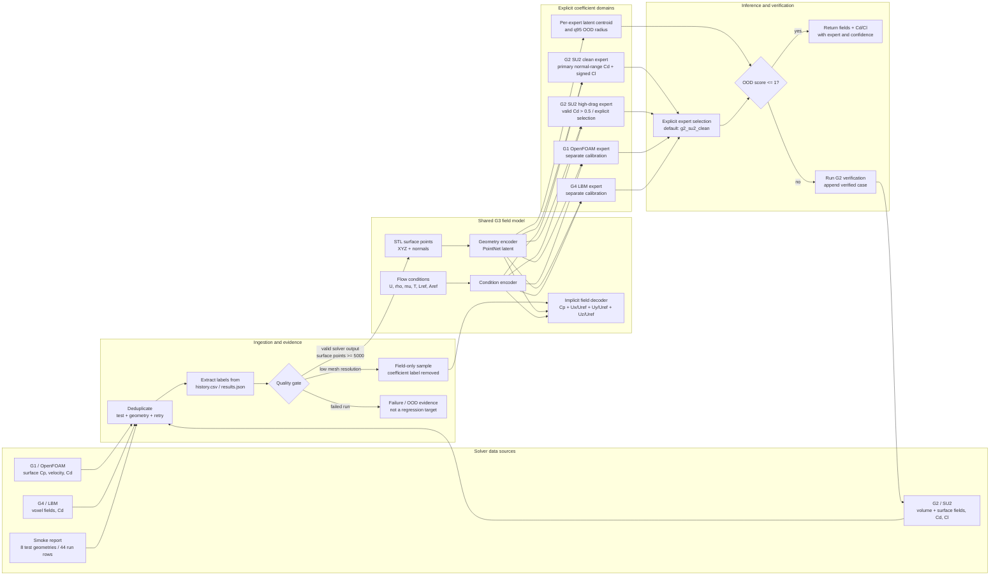

# G3 v6 architecture



## Training policy

1. The Cp/velocity backbone may use every readable field sample.
2. Cd/Cl supervision is accepted only when the run succeeded and the surface
   resolution passes the quality gate. Low-resolution labels remain recorded
   as rejected evidence but do not contribute to coefficient loss.
3. G1, G2, and G4 coefficient values are never blended into one head. Their
   solver setup and reference normalization can produce different values for
   the same STL, so each label domain owns independent heads and statistics.
4. The production default is `g2_su2_clean`. G1/G4 experts must be selected
   explicitly when their calibration is desired.
5. Valid G2 cases above Cd 0.5 are kept out of the normal-range head and train
   `g2_su2_high_drag`. This routes by an explicit domain/OOD decision at
   inference, never by looking at an unknown true Cd.
6. Every expert stores its geometry-latent centroid and 95% training radius.
   A normalized OOD score above 1 triggers a G2 verification recommendation.
7. Smoke-test failures train or evaluate failure/OOD handling only; they are
   never treated as Cd/Cl regression labels.

## Current v6 data flow

```text
g2_fields_v5 (113 cases)
    + smoke successful G2 FINAL/RBF_DSN cases
    -> deduplicate by surface-flow artifact
    -> keep all valid fields
    -> coefficient gate: >= 5,000 surface points
    -> group split by geometry family/test case
    -> train g2_su2_clean field checkpoint
    -> attach separately calibrated G1/G4 coefficient experts
    -> evaluate by held-out group and smoke-test geometry
```
